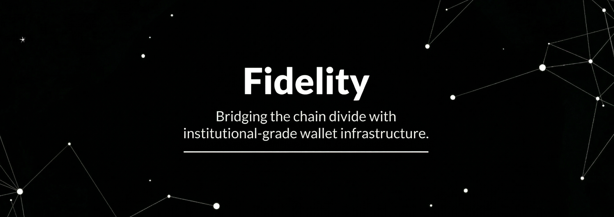

## Fidelity

**Fidelity** is a multi-chain cryptocurrency wallet platform designed to provide complete infrastructure for issuing and managing blockchain wallets at scale. The project includes the backend systems required to interact with blockchains as well as the client applications to be used for accessing and managing wallets.

Fidelity handles wallet creation, deposit monitoring, balance tracking through a reliable financial ledger, and withdrawal orchestration across multiple blockchain networks. By abstracting the complexity of blockchain integrations behind a structured platform, Fidelity makes it possible to build and operate crypto-enabled applications with a consistent and scalable foundation.

The project includes both web and mobile clients, allowing users to interact with their wallets while the backend infrastructure manages blockchain communication, transaction processing, and account state.

## Core Capabilities

* **Multi-Chain Support** — Integrates with major blockchain ecosystems including EVM-compatible networks, Bitcoin, and Solana.
* **Wallet Issuance** — Generate and manage deposit addresses for users across supported blockchains.
* **Financial Ledger** — Maintain accurate user balances through an append-only ledger that records blockchain deposits and withdrawals.
* **Deposit Monitoring** — Detect and confirm incoming blockchain transactions automatically.
* **Withdrawal Orchestration** — Process withdrawals through a controlled transaction pipeline with retry mechanisms and status tracking.
* **Web Client** — A browser-based interface for accessing wallets and managing digital assets.
* **Mobile Client** — A mobile application for interacting with wallets on the go.
* **Unified Platform Architecture** — Backend infrastructure and client applications built together to operate as a complete wallet platform.

## Vision

Fidelity aims to provide a reliable foundation for building crypto-enabled applications by simplifying wallet infrastructure across multiple blockchains. The project focuses on creating a scalable and secure platform that combines blockchain integrations, financial accounting, and modern client applications to make digital asset management accessible and dependable at scale.
